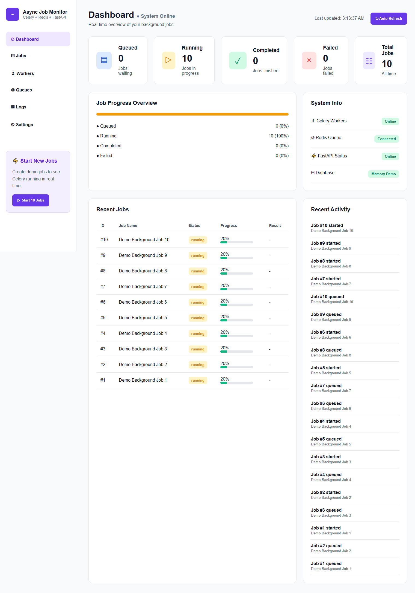

# Async Job Monitor

A portfolio project demonstrating how to build a real-time asynchronous job processing dashboard using **FastAPI**, **Celery**, **Redis**, **PHP**, and **JavaScript**.

The application simulates background jobs, processes them asynchronously with Celery workers, stores job information in Redis, and displays live progress through a responsive dashboard.

> **Note:** This is a personal learning project created to demonstrate my understanding of asynchronous task processing, REST APIs, Redis, and frontend/backend integration.

---

## Features

### Dashboard

* Real-time job monitoring
* Job status summary
* Progress visualization
* Recent job activity
* Auto-refresh dashboard
* Live job statistics

### Background Processing

* Queue multiple jobs simultaneously
* Process jobs asynchronously using Celery
* Track job progress from 0% to 100%
* Job status updates (Queued, Running, Completed, Failed)

### Backend

* REST API built with FastAPI
* Redis used for job and activity storage
* Celery worker for background task execution
* JSON API responses

### Frontend

* Responsive dashboard interface
* Dynamic updates using JavaScript Fetch API
* Progress bars
* Job table
* Activity feed

---

## Technologies Used

### Backend

* Python
* FastAPI
* Celery
* Redis

### Frontend

* PHP
* JavaScript
* HTML
* CSS

---

## Architecture

```text
                User
                  │
                  ▼
         PHP Dashboard (Frontend)
                  │
         JavaScript Fetch API
                  │
                  ▼
            FastAPI REST API
                  │
          Create Background Jobs
                  │
                  ▼
            Celery Worker
                  │
          Update Job Progress
                  │
                  ▼
              Redis Database
                  │
                  ▼
       Dashboard polls every 2 seconds
```

---

## Project Highlights

* Demonstrates asynchronous job processing
* Real-time dashboard updates
* REST API integration
* Background task execution
* Redis data storage
* Celery worker management
* Responsive dashboard design
* Separation of frontend and backend services

---

## Skills Demonstrated

* FastAPI
* Python
* Redis
* Celery
* REST API Development
* Asynchronous Processing
* Background Workers
* JavaScript
* PHP
* JSON APIs
* Frontend & Backend Integration

---

## Screenshots

### Dashboard




---


## Disclaimer

This project was developed for learning and portfolio purposes to demonstrate asynchronous job processing, API development, and full-stack integration using modern backend technologies.
